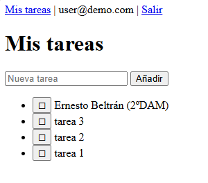
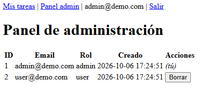
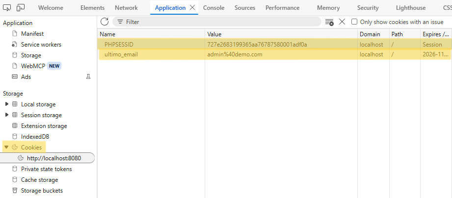
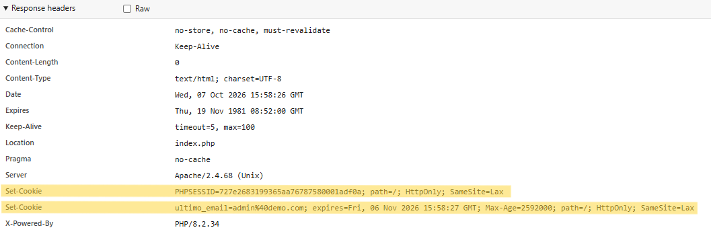

# Reflexion — MiniApp de Tareas

**Nombre:** Ernesto de Jesús Beltrán Marmolejos

## 1. Diferencia GET y POST, con un ejemplo de tu código donde usarías cada uno.

GET pide datos y los parámetros aparecen en la URL. POST, en cambio, envía datos en el cuerpo de la petición y es usado para información sensible o acciones que cambian el estado. En nuestro código usamos POST para los datos de inicio de sesión (sensible) en el login, y el GET lo usamos en el Reto 1.1 para probar, además de sus usos implícitos.

## 2. ¿Qué es una cabecera HTTP? Pon un ejemplo de cabecera de petición y otro de respuesta que hayas visto hoy.

Son metadatos `Clave: valor` de la petición o la respuesta.

Ejemplos vistos hoy:

* Petición: `Cookie: PHPSESSID=abc123`
* Respuesta: `Set-Cookie: PHPSESSID=abc123; HttpOnly` 

## 3. Explica con tus palabras qué es una cookie a nivel técnico: dónde se guarda, cómo viaja y quién puede leerla.

Es un `clave=valor` que el servidor envía con `Set-Cookie`. El navegador la guarda en el cliente y luego la reenvía en cada petición en la cabecera `Cookie`. La puede leer el servidor y el usuario, usando DevTools. JS solo la lee si no es `HttpOnly`.

## 4. Explica con tus palabras qué es una sesión y en qué se diferencia de una cookie. ¿Dónde se guarda cada una?

La sesión es una "caja" en el servidor y al cliente solo le llega al ID. A diferencia de la sesión, la cookie se guarda en el cliente.

## 5. Cita los tres mecanismos de persistencia usados en la MiniApp y para qué sirve cada uno.

* Base de datos: Para usuarios y tareas.
* Sesión: Para guardar el usuario activo que navega en ese momento.
* Cookie: Para recordar el email de inicio de sesión.

## 6. Diferencia autenticación vs autorización con un ejemplo de tu código.

* Autenticación: `login()` comprueba el email y `password_verify()` valida la contraseña.
* Autorización: `requireAdmin()` comprueba que el rol del usuario sea admin.

## 7. ¿Por qué llamamos a session_regenerate_id(true) tras el login?

Cambia el ID de sesión al hacer login con el propósito de evitar un tipo de ataque denominado `fixation`. 

## 8. ¿Qué pasaría si un usuario edita su cookie PHPSESSID a otro valor? ¿Y si edita ultimo_email?

Si edita PHPSESSID el server no va a poder encontrar la sesión, así que te manda a `login.php`. Por otro lado, si edita `ultimo_email`, estaría cambiando el valor recordado del campo email en el login.

## 9. ¿Qué significa que PHPSESSID tenga HttpOnly? ¿Qué ataque mitiga?

Significa que JavaScript no va a poder leer la cookie y, por lo tanto, PHPSESSID no va a aparecer si haces `document.cookie`.

# Capturas de pantalla

## Panel 'Mis Tareas' del usuario

## Panel del administrador

## Cookies almacenadas

## Set-Cookies en la respuesta del login
